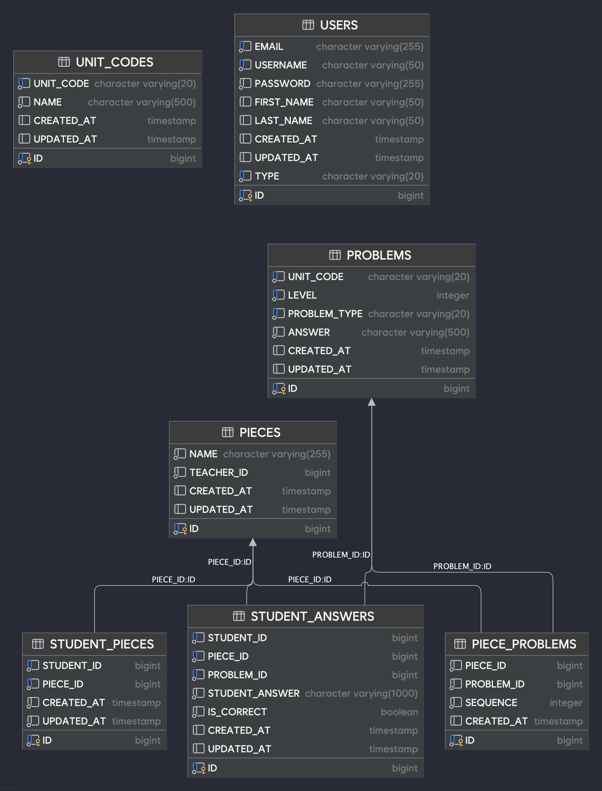

## 📖 프로젝트 개요

LMSM은 학습관리시스템으로, 교사가 문제를 선별하여 학습지를 만들고 학생들에게 배정하며, 학생들의 답안을 채점하고 분석하는 기능을 제공하는 **Spring Boot** 기반 멀티모듈 프로젝트입니다.

## 🏗️ 아키텍처

### 멀티모듈 구성

```
lmsm/
├── core/
│   ├── core-api/          # API 계층 (컨트롤러, 설정)
│   ├── core-common/       # 공통 모듈 (Enum, Exception, Response)
│   └── core-domain/       # 도메인 로직 (비즈니스 로직)
├── storage/
│   └── db-core/          # 데이터베이스 계층 (JPA, Flyway)
└── support/
    ├── logging/          # 로깅 지원
    └── monitoring/       # 모니터링 지원
```

### 클린 아키텍처 적용

- **API 계층**: 컨트롤러, 글로벌 예외 처리
- **Domain 계층**: 비즈니스 로직, 도메인 모델
- **Storage 계층**: 데이터베이스 접근, JPA 엔티티
- **Common 계층**: 공통 예외, 응답 모델, Enum

### ERD



## 🚀 주요 기능

### 1. 문제 관리

- 조건별 문제 조회 (단위코드, 난이도, 문제유형)
- 문제 선택 및 필터링

### 2. 학습지 관리

- 학습지 생성 및 문제 구성
- 문제 순서 조정
- 학생별 학습지 배정

### 3. 답안 채점

- 학생 답안 제출
- 자동 채점 시스템 (대소문자 무시, 공백 처리)
- 중복 제출 방지

### 4. 통계 분석

- 학습지별 학생 성취도 분석
- 문제별 정답률 통계
- 제출률 및 성과 분석

## 🛠️ 기술 스택

### Backend

- **Kotlin 2.1.0** + **Java 21**
- **Spring Boot 3.4.5**
- **Spring Data JPA**
- **Spring Boot Validation**
- **Flyway** (데이터베이스 마이그레이션)

### Database

- **H2 Database** (로컬 개발용)
- **MySQL** (dev, staging, live 환경)

### Testing

- **JUnit 5** + **Mockk**
- **Spring Boot Test**

### Build/Deploy

- **Gradle 8.0+** (멀티모듈 빌드)
- **Ktlint** (코드 스타일 검사)

## 🔧 API 엔드포인트

### Problem API

- `GET /api/v1/problems` - 조건별 문제 조회

### Piece API

- `POST /api/v1/pieces` - 학습지 생성
- `PATCH /api/v1/pieces/{pieceId}/order` - 문제 순서 조정
- `POST /api/v1/pieces/{pieceId}/assign` - 학생에게 학습지 배정
- `GET /api/v1/pieces/{pieceId}/problems` - 학생별 학습지 문제 조회
- `PUT /api/v1/pieces/{pieceId}/score` - 답안 채점
- `GET /api/v1/pieces/{pieceId}/analyze` - 학습지 분석

## 고민 지점

1. 선생, 학생을 구분짓기 위해서 Security로 붙여서 token 기반으로 filter layer에서 role을 구분짓고 싶었으나 우선 구현 우선으로 작업
    - 따라서 API에서 Id 값을 받고 있어서 요구사항을 명확하게 이행하고 있다고 보기 어려움
    - 유저가 API Id 값을 조작해서 API를 요청하면 달리 막을 수 없는 상태
    - 물론 PieceId를 특정해서 찾을 수 있어야 하지만 가능성이 존재하는 문제이므로 높은 우선 순위의 개선 포인트

2. StudentPiece를 도메인 layer에서 제거방법에 대해서 고민을 좀 더 해야하는 상황
    - StudentPiece가 하고 있는 역할은 Piece에서 assign한 결과를 매핑해서 스스로를 생성하는 것밖에 없어서
    - 따로 도메인으로 분리해야 하는지 고민이 되는 지점
    - 다만 단독으로 조회될 가능성이 많은 점과 그럴 경우 다른 로직을 가질 경우가 있을 가능성이 높아서 우선 분리

3. 병렬 처리 채점 시스템의 메모리 사용량 및 스레드 관리
    - 가상 스레드를 사용하여 동시성 처리를 하고 있지만, 대용량 트래픽에서의 메모리 사용량 예측이 어려움
    - 한 번에 많은 학생이 동시에 채점을 요청할 경우 시스템 리소스 부족 가능성
    - 채점 요청의 제한(Rate Limiting)이나 배치 처리 방식 도입 필요성 검토 필요

4. 통계 계산의 N+1 문제 및 대용량 데이터 처리
    - 학습지 분석 시 배정된 학생 수와 문제 수에 비례하여 쿼리 수가 증가하는 문제
    - 통계 계산을 위한 StudentAnswer 조회 시 메모리에 모든 데이터를 로드하는 방식
    - 대용량 데이터 환경에서 페이징 처리나 스트리밍 방식의 통계 계산 필요

5. 답안 평가 로직의 확장성 및 유지보수성
    - 현재 단순 문자열 비교 방식으로 답안을 평가하고 있어 다양한 답안 형태 지원 한계
    - 수학 문제의 경우 여러 정답 형태 (분수, 소수, 정수 등) 지원 필요
    - 주관식 답안의 경우 부분 점수나 유사도 기반 채점 시스템 필요

6. 도메인 간 결합도 및 응집도 개선
    - Piece 도메인이 Problem, StudentAnswer 등 여러 도메인과 강하게 결합되어 있는 상황
    - 도메인 이벤트를 통한 느슨한 결합 구조로 개선 필요성
    - 각 도메인의 책임과 경계를 명확히 하여 단일 책임 원칙 준수 필요

### 로컬 실행

```
src/main/kotlin/com.lms.api/LMSApplication.kt 실행
```

### 테스트 실행

```bash
# 전체 테스트
./gradlew test

# 특정 모듈 테스트
./gradlew :core:core-domain:test
```

주요 테스트 대상:

- 도메인 로직 (Piece, Problem, StudentAnswer)
- 서비스 계층 비즈니스 로직
- 컨트롤러 API 엔드포인트
- 리포지토리 데이터 접근
